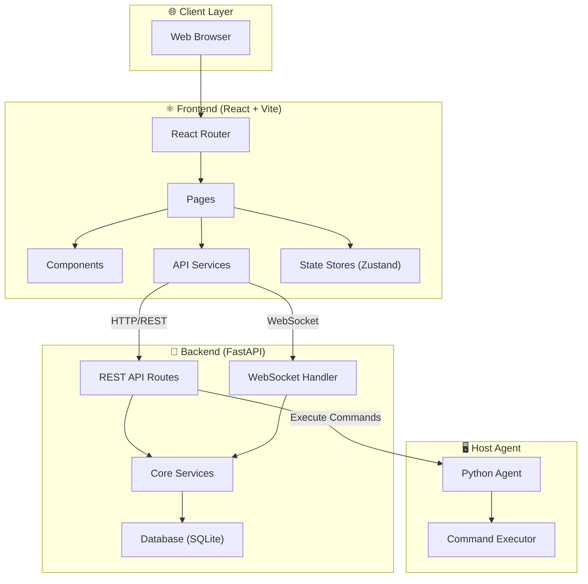
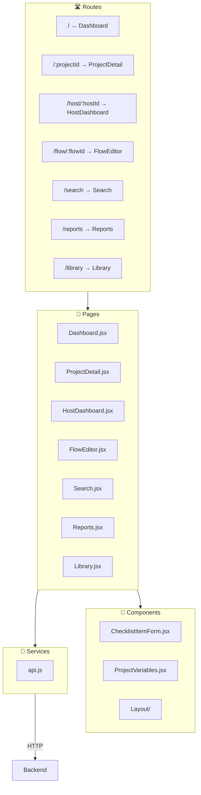
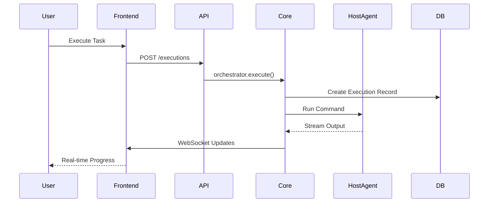

# Bars Project Architecture

A comprehensive penetration testing orchestration framework with a full-stack architecture.

## High-Level Architecture



---

## Project Structure

```
Bars/
├── 📂 backend/                    # Python FastAPI Backend
│   ├── app/
│   │   ├── api/                   # REST API Endpoints
│   │   ├── core/                  # Business Logic
│   │   ├── models/                # SQLAlchemy Models
│   │   ├── schemas/               # Pydantic Schemas
│   │   ├── websocket/             # Real-time Updates
│   │   ├── main.py                # App Entry Point
│   │   └── database.py            # DB Connection
│   ├── Dockerfile
│   └── requirements.txt
│
├── 📂 frontend/                   # React + Vite Frontend
│   ├── src/
│   │   ├── pages/                 # Route Pages
│   │   ├── components/            # UI Components
│   │   ├── services/              # API Client
│   │   ├── stores/                # State Management
│   │   └── App.jsx                # Main App
│   ├── Dockerfile
│   └── package.json
│
├── 📂 host_agent/                 # Command Execution Agent
│   └── main.py                    # Agent Script
│
├── docker-compose.yml             # Production Config
├── docker-compose.dev.yml         # Development Config
└── start.sh                       # Startup Script
```

---

## Backend Architecture

```mermaid
flowchart LR
    subgraph API["📡 API Layer (/api/v1)"]
        projects["projects.py"]
        checklists["checklists.py"]
        flows["flows.py"]
        executions["executions.py"]
        hosts["hosts.py"]
        files["files.py"]
        search["search.py"]
        reports["reports.py"]
    end
    
    subgraph Core["⚙️ Core Services"]
        orchestrator["orchestrator.py<br/>Task Orchestration"]
        flow_manager["flow_manager.py<br/>Flow Engine"]
        parser["parser.py<br/>Template Parser"]
        templating["templating.py<br/>Variable Substitution"]
        host_runner["host_runner.py<br/>Command Execution"]
        notifications["notifications.py<br/>Event Broadcasting"]
    end
    
    subgraph Models["📦 Data Models"]
        Project["Project"]
        Checklist["Checklist"]
        Flow["Flow"]
        Execution["Execution"]
        Host["Host"]
        File["File"]
        Variable["Variable"]
    end
    
    API --> Core
    Core --> Models
    Models --> DB[(SQLite)]
```



### API Endpoints

| Module | Purpose |
|--------|---------|
| `projects.py` | Project CRUD, management |
| `checklists.py` | Checklist templates, items |
| `flows.py` | Flow diagrams, import/export |
| `executions.py` | Task execution, output |
| `hosts.py` | Target host management |
| `files.py` | File attachments, storage |
| `search.py` | Global search functionality |
| `reports.py` | Report generation |

### Core Services

| Module | Purpose |
|--------|---------|
| `orchestrator.py` | Task execution coordination |
| `flow_manager.py` | Flow graph processing |
| `parser.py` | Checklist template parsing |
| `templating.py` | Variable substitution engine |
| `host_runner.py` | Remote command execution |
| `share_parser.py` | Specialized SMB/NFS share parsing |
| `notifications.py` | WebSocket event broadcasting |

---

## Data Storage & Temporary Files

The framework manages data across several locations:
* **Database (SQLite)**: Primary store for projects, hosts, findings, and execution logs.
* **Persistent Storage**: Location for generated reports and uploaded files.
* **Temporary Storage (`storage/tmp`)**: 
    * Used for passing large inputs (like target lists) to host commands.
    * Files are created by the `Orchestrator` using the `parameter_schema`.
    * **Lifecycle**: Files are created immediately before execution and deleted immediately after the subprocess completes.

---

## Frontend Architecture



### Pages Overview

| Page | Description |
|------|-------------|
| `Dashboard.jsx` | Project list, quick actions |
| `ProjectDetail.jsx` | Full project view, checklists, flows |
| `HostDashboard.jsx` | Target host management |
| `FlowEditor.jsx` | Visual flow diagram editor |
| `Search.jsx` | Global search interface |
| `Reports.jsx` | Report generation & export |
| `Library.jsx` | Checklist/Flow template library |

---

## Data Flow



---

## Technology Stack

| Layer | Technologies |
|-------|-------------|
| **Frontend** | React 18, Vite, TailwindCSS, Zustand, React Flow |
| **Backend** | FastAPI, SQLAlchemy, Pydantic, WebSockets |
| **Database** | SQLite |
| **Agent** | Python (aiohttp, subprocess) |
| **DevOps** | Docker, Docker Compose |

---

## Key Features

- ✅ **Project Management** - Organize pentests by project
- ✅ **Checklist Templates** - Reusable testing procedures  
- ✅ **Flow Editor** - Visual workflow diagrams
- ✅ **Command Execution** - Direct host command running
- ✅ **Real-time Updates** - WebSocket progress streaming
- ✅ **Template Library** - Import/Export checklist templates
- ✅ **Reporting** - Generate PDF/HTML reports
- ✅ **Search** - Global search across all entities
